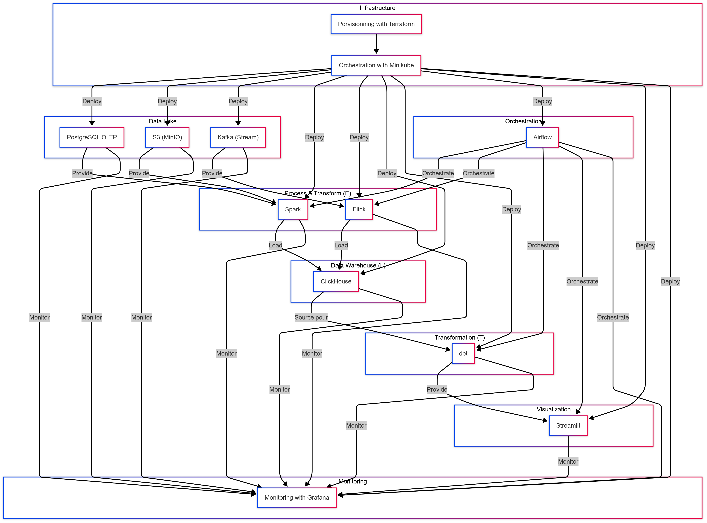

# data-engineering-pipeline

# Building an ETL using Kubernetes (minikube locally)

## Prerequisites

- **Minikube** cluster running
- **kubectl** CLI installed
- **Poetry** to run tests

## Note

Refer to each subrepository ReadMe to be able to run the services

# What is going to be built ? 

Using **Minikube or Kubernetes**

1. Postgres Database with 3 tables Clients, Orders and Products (for extract) ✅ ***Done***  ✅ 
2. Object Storage Minio with Products Metadata (for extract) ✅ ***Done*** ✅ 
3. Airflow Orchestrator 🏋️‍♂️ ***In progress*** 🏋️‍♂️ 
4. Kafka Stream 
5. Spark Worker 
6. Flink Consumer 
7. Clickhouse database as OLAP (for load and transfrom)
8. dbt worker (for transform)
9. Streamlit server (for visualisation)  
10. Terraform provisionning 
    

# The ETL Some code you can create

- Ingest Data from the S3 buckets
- Ingest Data from the Postgres Database
- We need to know which are the most bought products 
- ...
- ...